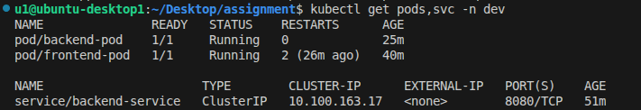
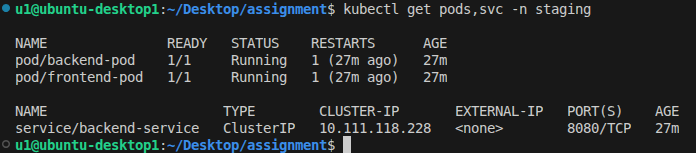

# Kubernetes Multi-Tenancy Lab (Dev & Staging Environments)

## Project Overview

This project demonstrates how to run multiple environments inside a single Kubernetes cluster using **Namespaces**.

Two isolated environments are deployed:

* **Development (dev)**
* **Staging (staging)**

Each namespace contains a **two-tier application**:

Frontend (NGINX) → Backend Service → Backend Pod (Python HTTP Server)

The lab demonstrates:

* Kubernetes Namespaces
* Pod-to-Pod communication using Services
* Reverse proxy configuration using NGINX
* Multi-environment deployment
* Environment isolation within the same cluster

---

# Architecture

```
                 Kubernetes Cluster
                        │
        ┌───────────────┴───────────────┐
        │                               │
      DEV Namespace                 STAGING Namespace
        │                               │
   Frontend Pod (NGINX)           Frontend Pod (NGINX)
            │                             │
            │ HTTP Proxy                  │ HTTP Proxy
            ▼                             ▼
     backend-service                backend-service
            │                             │
            ▼                             ▼
      Backend Pod                   Backend Pod
       Python App                    Python App
```

Each namespace runs the same application but operates independently.

---

# Project Structure

```
assignment/
│
├── backend-app.py
├── index.html
├── nginx.conf
│
├── Dockerfile.backend
├── Dockerfile.frontend
│
├── dev-environment.yaml
├── staging-environment.yaml
│
├── screenshots
│   ├── dev-resources.png
│   ├── staging-resources.png
│   └── application-ui.png
│
└── README.md
```

---

# Backend Application

The backend is a simple **Python HTTP server** running on port **8080**.

Available endpoints:

| Endpoint  | Description                           |
| --------- | ------------------------------------- |
| `/`       | Basic HTML page                       |
| `/health` | Health check endpoint                 |
| `/info`   | Returns Pod and namespace information |

Example response:

```
{
 "pod": "backend-pod",
 "namespace": "dev",
 "hostname": "backend-pod"
}
```

---

# Frontend Application

The frontend uses **NGINX** to:

* Serve the static web interface
* Proxy API requests to the backend service

Available API routes:

```
/api
/api/info
/api/health
```

The interface includes buttons to test backend connectivity.

---

# Build Docker Images

Build the backend image:

```
docker build -f Dockerfile.backend -t backend-app:latest .
```

Build the frontend image:

```
docker build -f Dockerfile.frontend -t frontend-app:latest .
```

If using **Minikube**, load the images:

```
minikube image load backend-app:latest
minikube image load frontend-app:latest
```

---

# Deploy Dev Environment

```
kubectl apply -f dev-environment.yaml
```

Check resources:

```
kubectl get pods,svc -n dev
```

---

# Deploy Staging Environment

```
kubectl apply -f staging-environment.yaml
```

Check resources:

```
kubectl get pods,svc -n staging
```

---

# Access the Application

Forward the frontend port:

```
kubectl port-forward pod/frontend-pod 8082:80 -n dev
```

Open the application in your browser:

```
http://localhost:8082
```

---

# Screenshots

## Dev Namespace Resources

Output of:

```
kubectl get pods,svc -n dev
```



---

## Staging Namespace Resources

Output of:

```
kubectl get pods,svc -n staging
```



---

## Application Interface

Frontend UI showing backend connectivity.


---

# Kubernetes Concepts Demonstrated

This lab demonstrates several core Kubernetes concepts:

* Namespaces for environment isolation
* Pod networking
* ClusterIP Services
* Internal DNS communication
* Reverse proxy architecture
* Multi-tier application deployment

---

# Author

Antonios Mounir
Kubernetes Lab Assignment
DevOps / Cloud Native Practice
